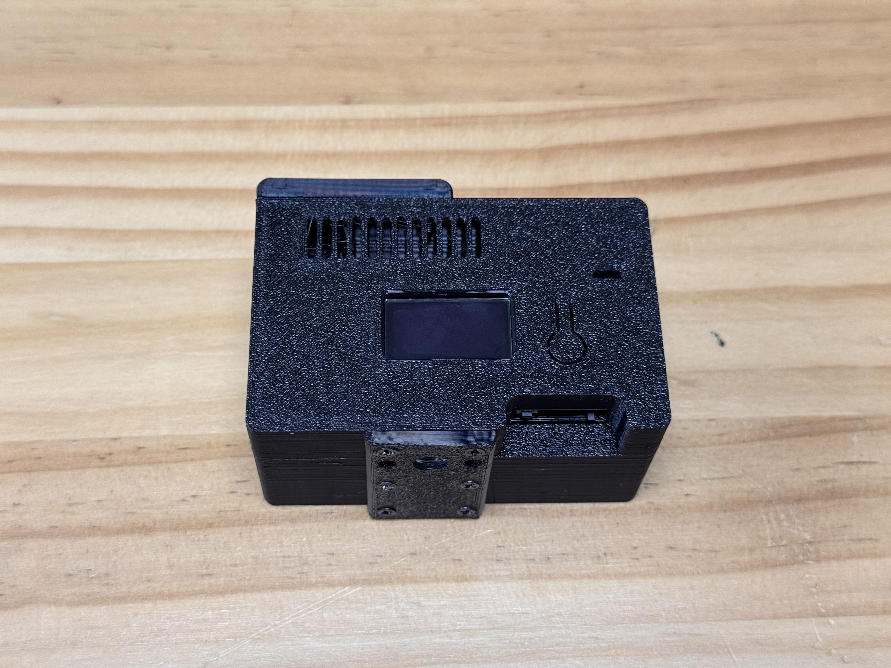
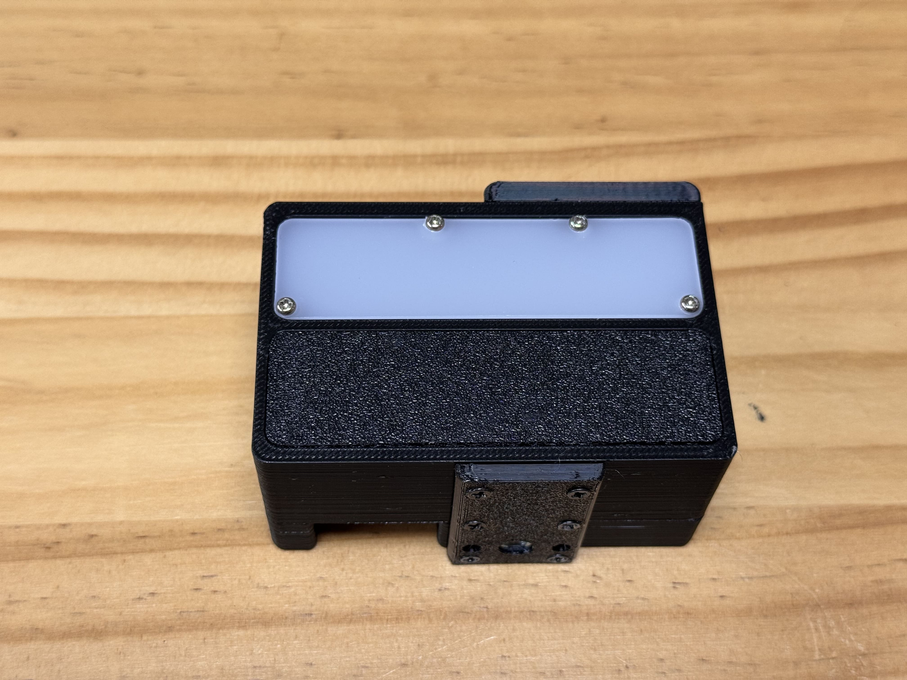
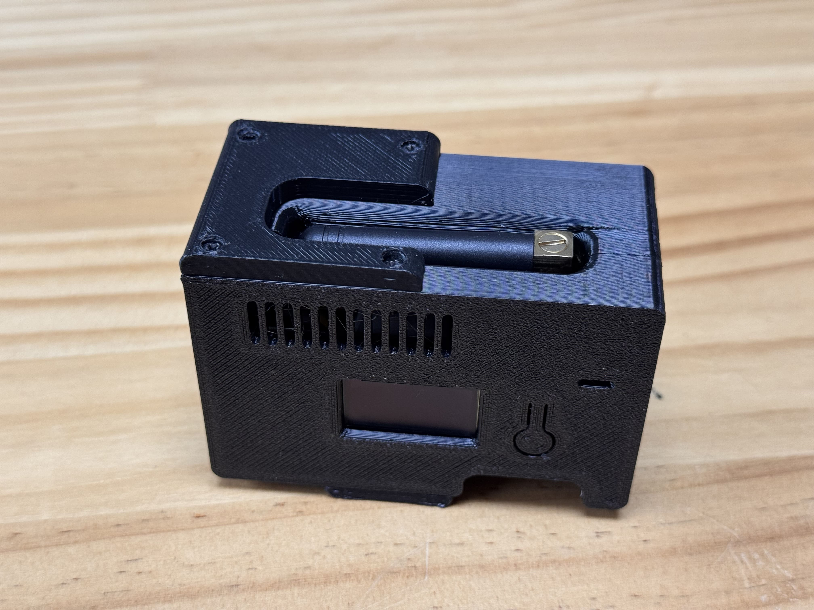
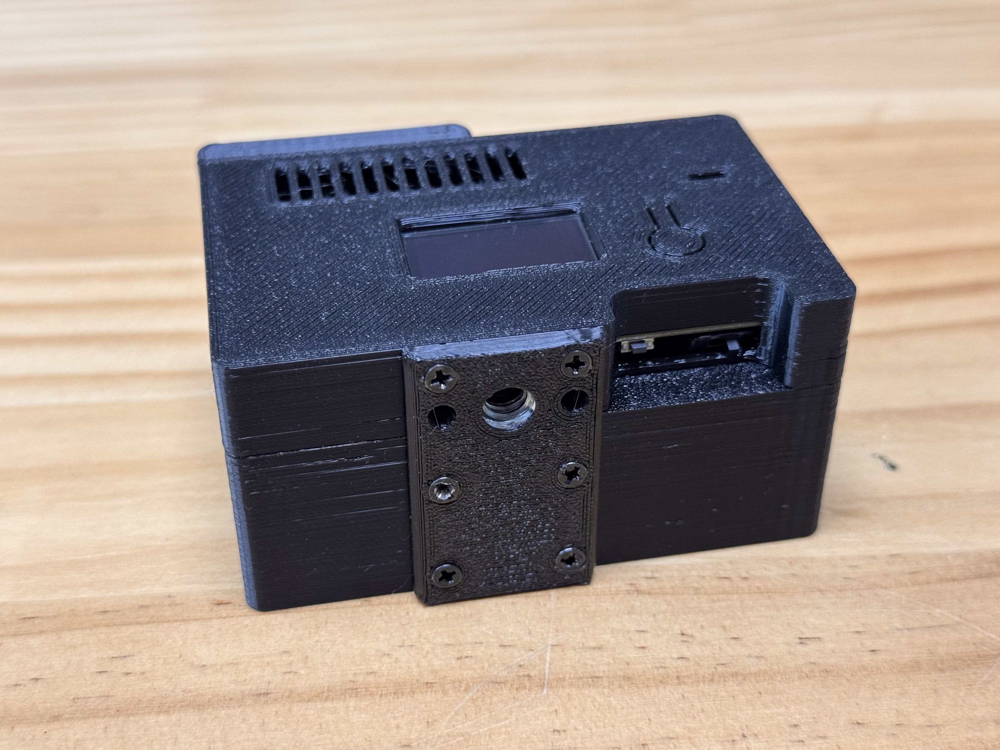

## 3D 파일 출력 방법
### 파일 다운로드
* 3mf 파일 다운로드
* 슬라이서 프로그램에서 오브젝트 분리 후 출력 진행

 

## 공통 디자인
 
기본 형태의 디자인으로, 모든 버전에 공통 적용됩니다.  

## 직각 안테나용 디자인
 
직각 안테나를 사용하는 환경에 최적화된 디자인입니다.  

## 기본 안테나용 디자인
 
일반적인 수직형 안테나를 위한 기본 디자인입니다.  

## 실제 조립 후 모습
 
 
 
 