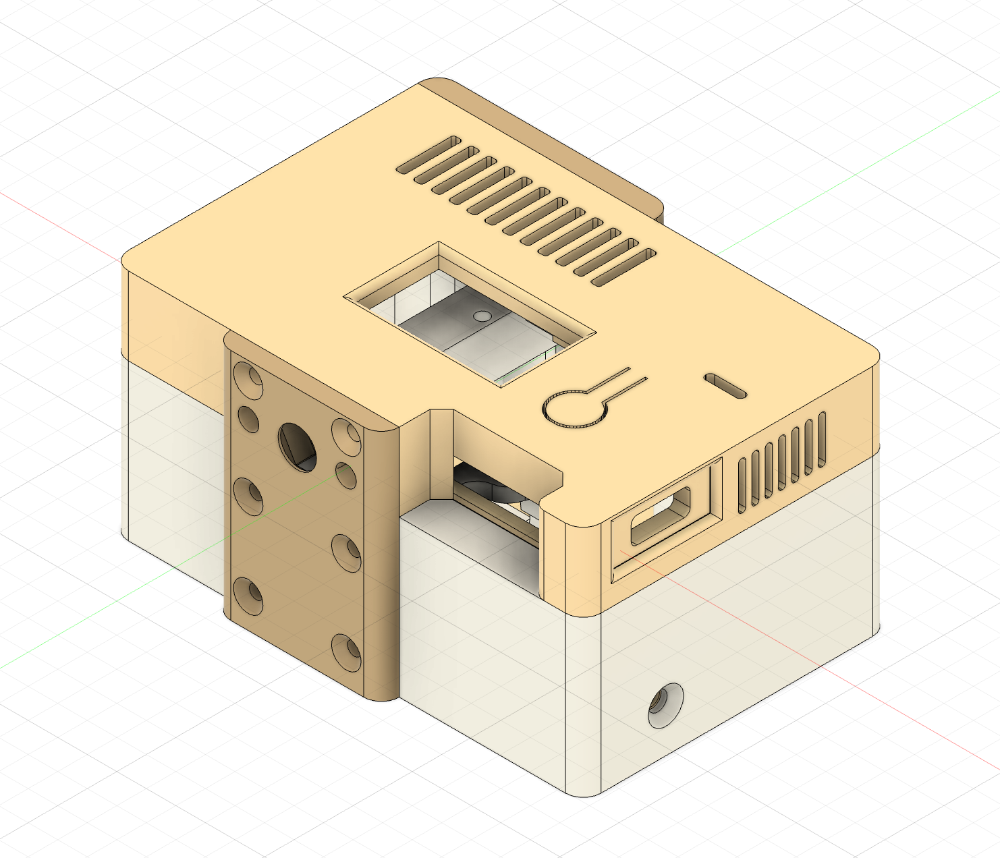
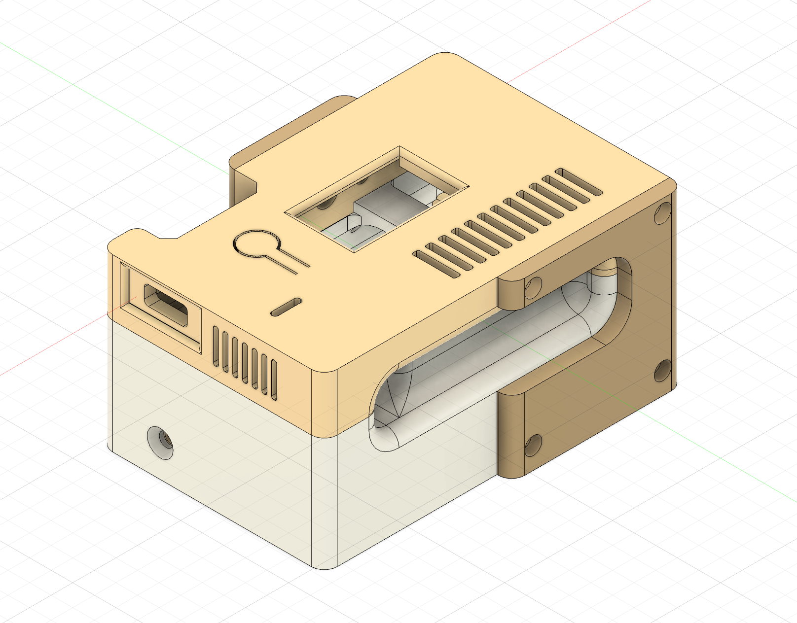
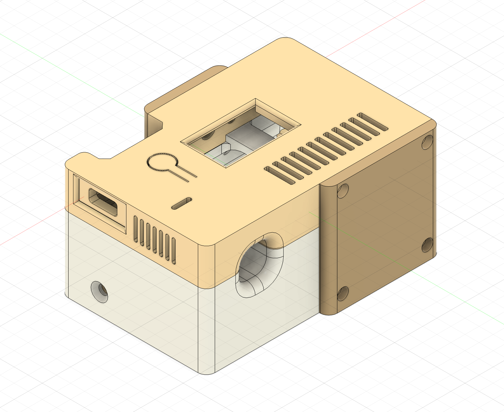

### 3D File Printing Method

#### File Download

* Download the 3MF or STL file
* Open it in a slicer program, separate the objects, and proceed with printing

---

### 3D 파일 출력 방법

#### 파일 다운로드
- 3mf 혹은 stl 파일 다운로드
- 슬라이서 프로그램에서 오브젝트 분리 후 출력 진행

</img> 

</img> 

</img> 
