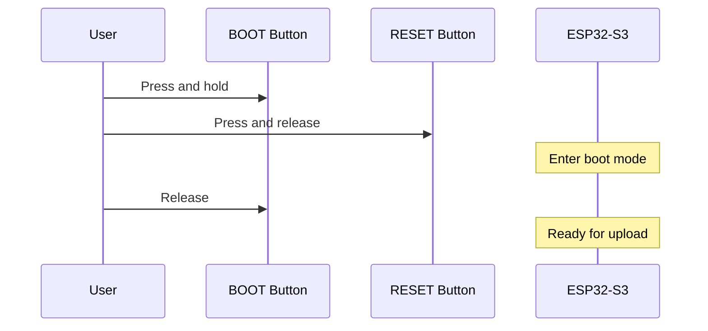

# 펌웨어 설치

TALLY NODE 펌웨어를 설치하는 방법을 안내합니다.

## 🌐 웹 기반 설치 (권장)

가장 쉬운 방법은 웹 브라우저를 통한 설치입니다.

[펌웨어 업로드 페이지로 이동 :material-upload:](upload.md){ .md-button .md-button--primary }

### 지원 브라우저
- ✅ Chrome (88+)
- ✅ Edge (88+)
- ✅ Opera (74+)
- ❌ Firefox (지원 예정)
- ❌ Safari (지원 예정)

## 🛠️ 개발 환경 설치

개발자나 고급 사용자를 위한 PlatformIO 기반 설치 방법입니다.

### 1. PlatformIO 설치

=== "Windows"
    ```cmd
    # Python 설치 (3.7 이상)
    python --version
    
    # PlatformIO 설치
    pip install platformio
    ```

=== "macOS"
    ```bash
    # Homebrew로 Python 설치
    brew install python
    
    # PlatformIO 설치
    pip3 install platformio
    ```

=== "Linux"
    ```bash
    # Ubuntu/Debian
    sudo apt update
    sudo apt install python3 python3-pip
    pip3 install platformio
    
    # CentOS/RHEL
    sudo yum install python3 python3-pip
    pip3 install platformio
    ```

### 2. 프로젝트 다운로드

```bash
# Git 클론
git clone https://github.com/username/TALLY_NODE.git
cd TALLY_NODE/esp32-s3
```

### 3. 빌드 환경 설정

프로젝트는 주파수별로 다른 빌드 환경을 제공합니다:

#### 400MHz 빌드 환경
- **m400**: 마스터 모드 (400MHz)
- **r400**: 리시버 모드 (400MHz)

#### 900MHz 빌드 환경  
- **m900**: 마스터 모드 (900MHz)
- **r900**: 리시버 모드 (900MHz)

### 4. 펌웨어 빌드

=== "마스터 (400MHz)"
    ```bash
    # 빌드
    pio run -e m400
    
    # 업로드
    pio run -e m400 --target upload
    
    # 시리얼 모니터
    pio device monitor
    ```

=== "리시버 (400MHz)"
    ```bash
    # 빌드
    pio run -e r400
    
    # 업로드  
    pio run -e r400 --target upload
    
    # 시리얼 모니터
    pio device monitor
    ```

=== "마스터 (900MHz)"
    ```bash
    # 빌드
    pio run -e m900
    
    # 업로드
    pio run -e m900 --target upload
    
    # 시리얼 모니터
    pio device monitor
    ```

=== "리시버 (900MHz)"
    ```bash
    # 빌드
    pio run -e r900
    
    # 업로드
    pio run -e r900 --target upload
    
    # 시리얼 모니터
    pio device monitor
    ```

## 🔧 부트 모드 진입

펌웨어 업로드를 위해서는 ESP32-S3를 부트 모드로 진입시켜야 합니다.

### 자동 부트 모드 (권장)
1. USB-C 케이블로 컴퓨터에 연결
2. 업로드 명령 실행
3. 자동으로 부트 모드 진입

### 수동 부트 모드
자동 부트가 실패할 경우:

1. **BOOT 버튼**을 누른 상태로 유지
2. **RESET 버튼**을 한 번 누르고 떼기
3. **BOOT 버튼**을 떼기
4. 부트 모드 진입 완료



## 📱 펌웨어 버전 확인

업로드가 완료되면 펌웨어 정보를 확인할 수 있습니다.

### OLED 디스플레이
- 부팅 시 펌웨어 버전 표시
- 시스템 정보 페이지에서 확인 가능

### 시리얼 모니터
```
[INFO] TALLY NODE v1.2.0
[INFO] Build: m900 (Master 900MHz)  
[INFO] Compiled: 2024-01-15 14:30:22
[INFO] ESP32-S3 Chip Rev: 0.1
[INFO] Free Heap: 234KB
[INFO] PSRAM: 1.8MB
```

### 웹 인터페이스 (마스터 모드)
1. WiFi AP에 연결: `TALLY_NODE_AP`
2. 브라우저에서 `192.168.4.1` 접속
3. 상태 페이지에서 펌웨어 정보 확인

## ⚠️ 문제 해결

### 업로드 실패

#### "Serial port not found"
```bash
# 포트 확인
pio device list

# 수동 포트 지정
pio run -e m400 --target upload --upload-port COM3    # Windows
pio run -e m400 --target upload --upload-port /dev/ttyUSB0  # Linux
```

#### "Failed to connect to ESP32"
1. **부트 모드 재시도**
   - 수동 부트 모드 진입
   - 다른 USB 케이블 사용

2. **드라이버 확인**
   - ESP32-S3 USB 드라이버 설치
   - 장치 관리자에서 인식 확인

3. **케이블 확인**
   - 데이터 전송 지원 USB-C 케이블 사용
   - 충전 전용 케이블은 사용 불가

#### "Flash size mismatch"
```bash
# 플래시 정보 확인
esptool.py --port COM3 flash_id

# 강제 업로드 (주의: 잘못 사용 시 벽돌 위험)
pio run -e m400 --target upload --upload-flag --flash-size=4MB
```

### 부팅 실패

#### OLED 디스플레이가 안 켜짐
1. **하드웨어 확인**
   - I2C 연결 상태 확인 (SDA: GPIO18, SCL: GPIO17)
   - 3.3V 전원 공급 확인

2. **펌웨어 재설치**
   - 전체 플래시 지우기 후 재설치

#### WiFi 연결 실패 (마스터 모드)
1. **설정 초기화**
   - BOOT 버튼을 5초간 누름 (부팅 후)
   - 팩토리 리셋 실행

2. **수동 설정**
   - AP 모드로 접속하여 WiFi 재설정

#### LoRa 통신 실패
1. **안테나 확인**
   - U.FL 커넥터 연결 상태 확인
   - 주파수 대역 확인 (433MHz/915MHz)

2. **펌웨어 일치**
   - 마스터와 리시버의 주파수 대역이 같은지 확인

## 🔄 펌웨어 업데이트

### OTA 업데이트 (마스터 모드)
웹 인터페이스를 통한 무선 업데이트:

1. 웹 대시보드 접속
2. "설정" → "펌웨어 업데이트" 메뉴
3. 새 펌웨어 파일(.bin) 업로드
4. 자동 재부팅 및 적용

### USB 업데이트 (전체 모드)
USB를 통한 전통적인 업데이트:

1. 최신 펌웨어 파일 다운로드
2. [웹 업로드 도구](upload.md) 사용
3. 또는 PlatformIO 명령 사용

---

다음: [펌웨어 설정](configuration.md)