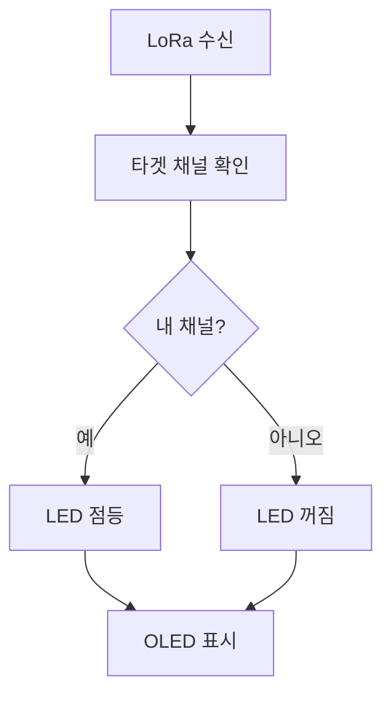

# 빠른 시작 가이드

TALLY NODE를 처음 사용하는 분들을 위한 단계별 가이드입니다.

## 🚀 15분 만에 시작하기

### 1단계: 하드웨어 준비 (2분)
- [x] TALLY NODE 기기 준비 (마스터 1개, 리시버 1개 이상)
- [x] USB-C 케이블 준비
- [x] 배터리 충전 확인 (3.6V 이상)

### 2단계: 펌웨어 설치 (5분)
1. **웹 업로드 도구 사용** (권장)
   - [펌웨어 업로드 페이지](../firmware/upload.md) 접속
   - Chrome/Edge/Opera 브라우저 사용
   - 마스터: Master 900MHz 선택
   - 리시버: Receiver 900MHz 선택

2. **자동 업로드**
   - USB 연결 후 "펌웨어 설치하기" 클릭
   - 포트 선택 후 자동 설치

### 3단계: 마스터 설정 (5분)
1. **WiFi 연결**
   - SSID: `TALLY_NODE_AP` 연결
   - 비밀번호: `12345678`

2. **웹 설정**
   - 브라우저에서 `192.168.4.1` 접속
   - 스위처 IP 주소 입력 (예: 192.168.1.240)
   - 스위처 종류 선택 (ATEM/vMix)

3. **네트워크 설정**
   - 스튜디오 WiFi에 연결
   - DHCP 또는 고정 IP 설정

### 4단계: 리시버 설정 (2분)
1. **타겟 채널 설정**
   - 버튼 길게 누르기 → 설정 모드
   - "Target Ch" 선택
   - 원하는 채널 번호 설정 (1-40)

2. **동작 확인**
   - OLED에 RSSI 신호 확인
   - 스위처에서 채널 전환 테스트

### 5단계: 테스트 (1분)
- [x] 마스터에서 스위처 연결 확인
- [x] 리시버에서 신호 수신 확인  
- [x] LED 색상 변경 테스트
- [x] 배터리 레벨 확인

## 🎯 주요 사용법

### 마스터 (송신기)


**웹 대시보드 기능:**
- 실시간 Tally 상태 모니터링
- 연결된 리시버 목록
- 시스템 상태 및 배터리 정보
- 설정 변경 및 펌웨어 업데이트

### 리시버 (수신기)


**LED 색상 의미:**
- 🟢 **녹색**: Program (ON AIR)
- 🔴 **빨간색**: Preview (준비)
- 🔵 **파란색**: Program + Preview
- ⚫ **꺼짐**: Off Air

## 📱 일상적인 사용

### 촬영 시작 전
1. 모든 기기 전원 켜기
2. 마스터 웹 대시보드에서 연결 상태 확인
3. 각 리시버의 배터리 레벨 확인
4. 스위처에서 채널 전환 테스트

### 촬영 중
- 리시버는 자동으로 동작 (별도 조작 불필요)
- 마스터 웹 대시보드로 전체 상태 모니터링
- 배터리 경고 시 즉시 교체

### 촬영 후
1. 배터리 충전
2. 펌웨어 업데이트 확인
3. 설정 백업 (선택사항)

## 🔧 자주 사용하는 설정

### 스위처별 설정

#### ATEM 설정
```json
{
  "type": "ATEM",
  "ip": "192.168.1.240",
  "me_selection": "ME1",
  "channels": 8
}
```

#### vMix 설정
```json
{
  "type": "vMix", 
  "ip": "192.168.1.100",
  "port": 8099,
  "channels": 16
}
```

### LoRa 설정 최적화

#### 스튜디오 환경
- **전송 파워**: 10-15dBm (중간)
- **전송 간격**: 200ms (기본값)
- **패킷 헤더**: 0x01 (기본값)

#### 야외/대형 스튜디오
- **전송 파워**: 20-22dBm (최대)
- **전송 간격**: 150ms (빠름)
- **패킷 헤더**: 고유값 설정

## ⚠️ 문제 해결 체크리스트

### 연결 문제
- [ ] 마스터와 리시버가 같은 주파수인가? (400MHz/900MHz)
- [ ] LoRa 안테나가 제대로 연결되었는가?
- [ ] 배터리가 충분히 충전되어 있는가?
- [ ] 스위처와 같은 네트워크에 있는가?

### 성능 문제
- [ ] 금속 물체나 다른 전자기기로부터 거리를 두었는가?
- [ ] LoRa 전송 파워를 올려보았는가?
- [ ] 여러 TALLY NODE 시스템이 같은 패킷 헤더를 사용하지 않는가?

### 배터리 문제
- [ ] 배터리가 3.6V 이상인가?
- [ ] 충전기가 정상 작동하는가?
- [ ] 배터리 커넥터가 제대로 연결되었는가?

## 📚 추가 학습 자료

- **[하드웨어 사양](../hardware/specifications.md)**: 기술적 세부사항
- **[API 문서](../firmware/api.md)**: 프로그래밍 인터페이스
- **[문제 해결](troubleshooting.md)**: 상세한 문제 해결 가이드
- **[사용 예시](examples.md)**: 실제 사용 사례

---

이제 TALLY NODE를 사용할 준비가 완료되었습니다! 🎬