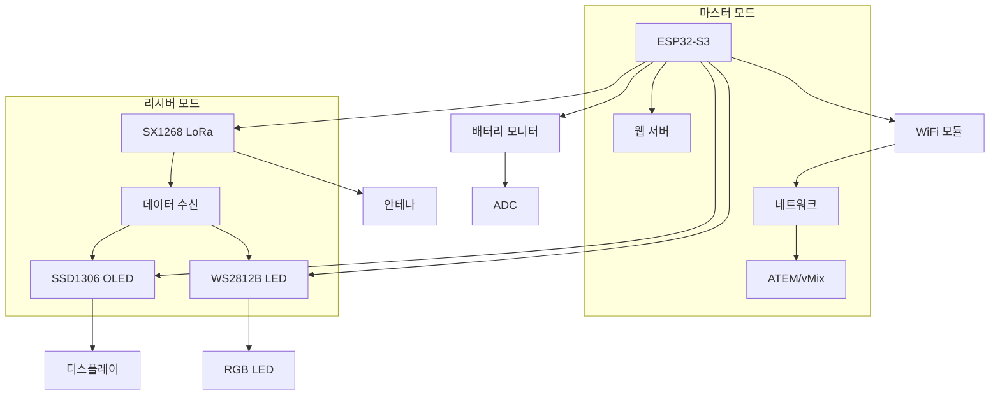

# 하드웨어 개요

TALLY NODE는 ESP32-S3를 기반으로 한 커스텀 PCB로 구성된 무선 Tally 시스템입니다.

## 📋 주요 구성 요소

### TALLY NODE V1 보드

전용으로 설계된 커스텀 PCB로 모든 필요한 구성 요소가 통합되어 있습니다.

-   :material-memory: **MCU**

    ---

    **ESP32-S3**  
    240MHz 듀얼 코어  
    4MB Flash, 2MB PSRAM

-   :material-wifi: **무선 통신**

    ---

    **SX1268 LoRa 모듈**  
    433MHz/915MHz  
    최대 22dBm 출력

-   :material-monitor-small: **디스플레이**

    ---

    **SSD1306 OLED**  
    128x64 해상도  
    I2C 인터페이스

-   :material-led-strip-variant: **LED**

    ---

    **WS2812B RGB LED**  
    개별 제어 가능  
    리시버용 Tally 표시

## 🔌 인터페이스

### 전원 및 통신
- **USB-C**: 펌웨어 업로드 및 전원 공급
- **배터리 커넥터**: LiPo 배터리 연결
- **전원 스위치**: 메인 전원 제어

### 사용자 인터페이스
- **OLED 디스플레이**: 실시간 상태 표시
- **푸시 버튼**: 페이지 전환 및 설정
- **LED 표시등**: 보드 상태 및 Tally 표시

### 확장 인터페이스
- **SD 카드 슬롯**: 향후 확장 용도 (현재 미사용)
- **GPIO 확장**: 추가 센서나 액추에이터 연결 가능

## 🏗️ 시스템 아키텍처

## 💡 동작 모드

### 마스터 모드 (송신기)
- **스위처 연동**: WiFi를 통해 ATEM/vMix와 통신
- **데이터 처리**: Tally 정보를 수집하고 패킷으로 변환
- **무선 전송**: LoRa를 통해 모든 리시버에 브로드캐스트
- **웹 인터페이스**: 실시간 모니터링 및 설정

### 리시버 모드 (수신기)
- **데이터 수신**: LoRa를 통해 마스터로부터 데이터 수신
- **상태 표시**: OLED와 RGB LED를 통한 Tally 상태 표시
- **타겟 모드**: 특정 채널만 표시하도록 설정 가능
- **배터리 모니터링**: 실시간 배터리 상태 확인

## ⚡ 전력 관리

### 전원 공급
- **USB 전원**: 5V/500mA (개발 및 설정용)
- **배터리**: 3.7V LiPo (운용 시)
- **자동 전환**: USB 연결 시 배터리 충전 모드

### 전력 소비
| 모드 | 소비 전력 | 예상 운용 시간 |
|------|----------|---------------|
| **마스터** (WiFi + LoRa) | ~200mA | 4-6시간 |
| **리시버** (LoRa + OLED + LED) | ~100mA | 8-12시간 |
| **슬립 모드** | ~10mA | 100+ 시간 |

### 배터리 모니터링
- ADC를 통한 실시간 전압 측정
- ESP32 ADC 특성에 맞춘 캘리브레이션
- 배터리 레벨 표시 (%, 전압)
- 저전압 경고 기능

## 🛡️ 보호 기능

### 하드웨어 보호
- **과전압 보호**: USB 및 배터리 입력
- **역극성 보호**: 배터리 연결 실수 방지
- **ESD 보호**: 정전기 방전 보호

### 소프트웨어 보호
- **와치독 타이머**: 시스템 행업 방지
- **예외 처리**: 네트워크 및 통신 오류 복구
- **안전 모드**: 설정 오류 시 기본값으로 복구

---

다음: [기술 사양 및 핀 정의](specifications.md)